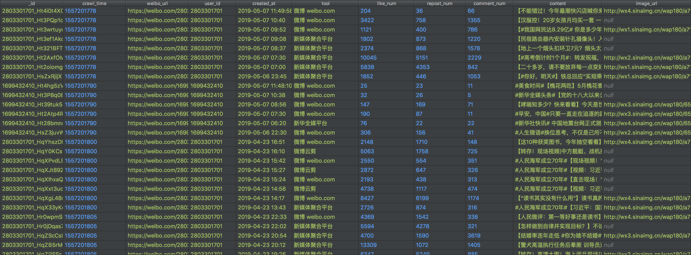

## 微博数据字段

### 用户数据
|    字段   | 说明 |
| :---: | :----: |
|_id       | 用户的ID，可以作为用户的唯一标识 |
|nick_name|昵称|
|gender|性别|
|province | 所在省|
|city |所在市|
|brief_introduction|个人简介|
|birthday |生日|
|tweets_num | 微博发表数|
|fans_num| 粉丝数|
|followers_num|关注数|
|sex_orientation|性取向|
|sentiment|感情状况|
|vip_level| 会员等级|
|authentication|认证情况|
|person_url|用户首页链接|
|labels|用户标签，用逗号分割|
|crawl_time|抓取时间戳|

示例:

### 微博数据
|    字段   | 说明 |
| :---: | :----: |
| _id | 微博id |
|user_id| 这则微博作者的ID |
|content |微博的内容|
|created_at |微博发表时间|
|repost_num |转发数|
|comment_num |评论数|
|like_num| 点赞数|
|tool|发布微博的工具|
|image_url|微博中图片的URL，注意如果是组图会只抓取第一张|
|video_url|微博中视频的URL|
|location|定位信息|
location_map_info|定位的经纬度信息|
|origin_weibo|原始微博，只有转发的微博才有这个字段|
|crawl_time|抓取时间戳|

示例:

### 用户关系数据
|    字段   | 说明 |
| :---: | :----: |
| _id | 用户关系id |
|fan_id| 关注者的用户ID |
|follower_id|被关注者的用户ID|
|crawl_time|抓取时间戳|

示例:

### 评论数据
|    字段   | 说明 |
| :---: | :----: |
| _id | 评论的id |
|comment_user_id|评论的用户ID|
|weibo_url|weibo的URL|
|content|评论内容|
|created_at| 评论创建时间|
|crawl_time|抓取时间戳|

示例:
